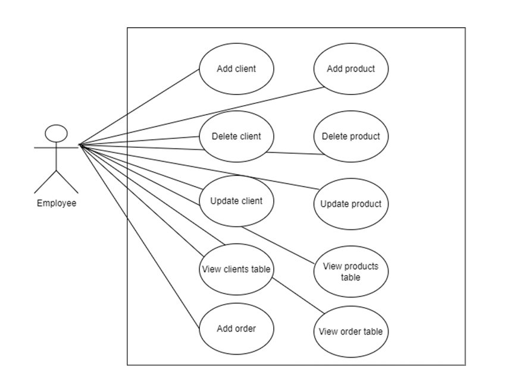

# Order-Management-Application

## Objective
The goal of this preoject is to design and implement an application that allows employees to manage client orders for a warehouse. This includes adding, updating, and deleting clients and products, creating orders, and maintaining data consistency in a PostgresSQL database.

## Features
 - **Client Management**: Add, update, and delete clients with proper validation.
 - **Product Management**: Manage product details like name, price, and stock.
 - **Order Management**: Create orders by selecting a client and product. Updates stock dynamically and handles insufficient stock gracefully.
 - **Database Integration**: Use PostgresSQL to persist data.
 - **Real-Time Updates**: Reflects changes in data tables immediately upon actions.
 - **Error Handling**: Displays clear error messages for invalid inputs.

## Package Structure
The application is divided into the following packages:
 1. **Model**: Defines the core data models (e.g., Client, Product, Orders).
 2. **DataAccess**: Handles database queries and connections using DAO classes.
 3. **BusinessLogic**: Implements business rules and validation logic.
 4. **Presentation**: Manages the GUI and interaction with users.
 5. **Connection**: Handles the connection to the PostgresSQL database.

## Use case

